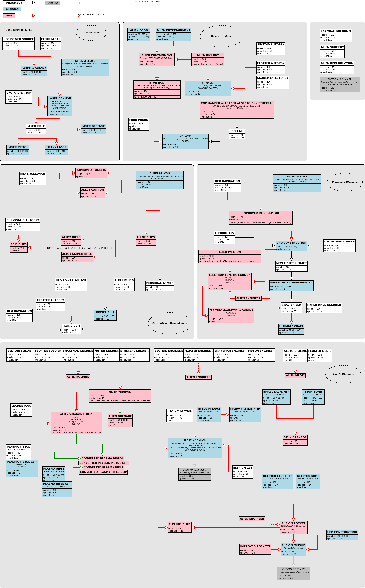

#The main ideas

- Aliens technologies cannot be reproduced
- Aliens weapons are controlled by mind and can not be used in battles
- Conventional weapons should be suitable as long as possible

##Research

The big point in the game is on Research tree. AwesomeGuns modification changes a few of researches and implements something new.

#### Biological research

- Alien containment depends on alien biology that is necessary for keeping alien live.
- Also, the Alien food and Alien entertainment are necessary, because these can keep alien live.
- The Alien biology opens the MEDI Kit that can be manufactured from alien corpses. 
- Alien research and interrogation are important. These research are opening the alien weapons.

#### Conventional weapon and Crafts

- Improved interceptor (RAVEN) can be research at beginning. This aircraft has a great defence and does not consume Elerium
- A lot of weapons from alien alloys were implemented for aircrafts and battlefields
- Bullets from alien alloys that have a great power, acid ammo and Elerium bullets that can blast enemy and more... 
- New armours and equipments for soldiers were introduced

#### Laser weapon

- Laser technology depends on Elerium and UFO Power Source
- Research of laser weapon opens from craft cannon
 
#### Alien weapon

- Research of alien weapon depends on interrogation. Alien soldier, engineer and medic are necessary for this
- The alien weapons are controlled by mind, therefore alien weapons can not be used by human without changing
- The plasma pistols and plasma rifles can be converted for using in combats
- The heavy plasma and blaster bombs can not be used in combats, but can be used in manufacturing weapons for aircrafts
- The stun grenade can be manufactured from alien stun bomb
 
#### Following diagram describes all changes

